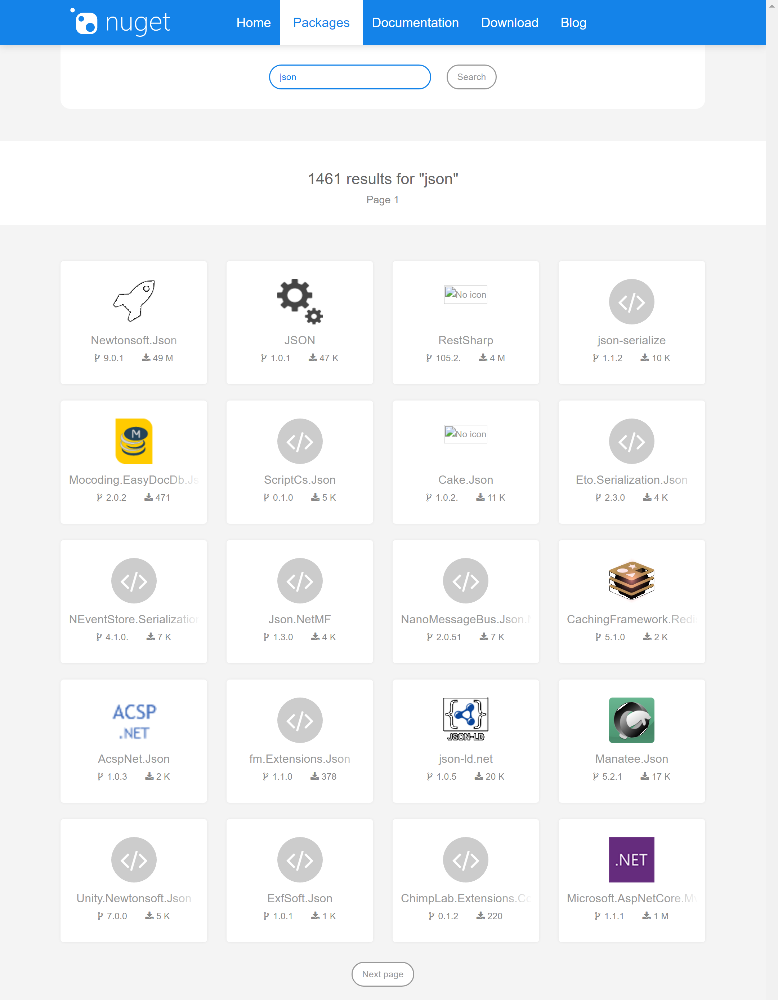
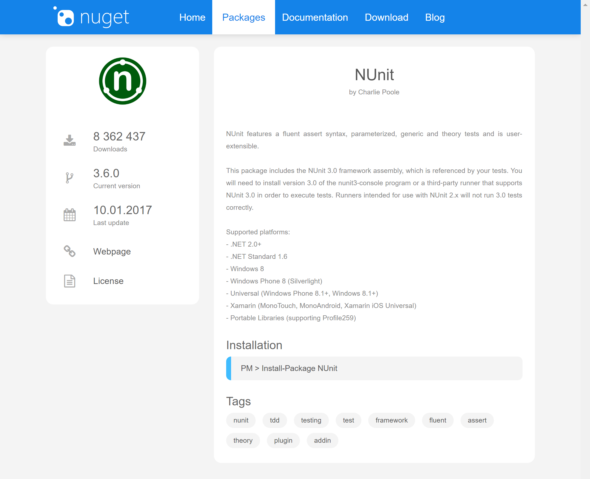
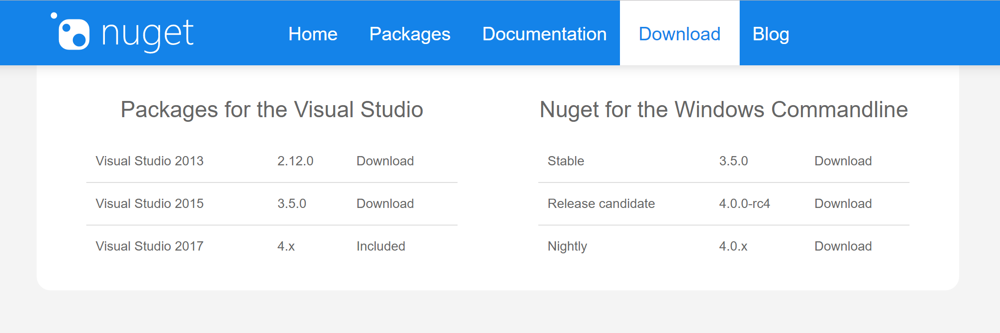

# NuGet Modern Website Prototype
This project was created to check how the official NuGet website will look like after applying modern web-design styles. The most important details are listed below:
- the project is based on the .NET Core technology,
- it is only a prototype (much better results can be obtained),
- information presented on the website is correct and up-to-date because the script is communicating through the APIv3 with the NuGet platform.

## Problems
During the implementation, some problems connected to the NuGet's APIv3 were encountered:
- provided statistics are not the same as the official ones on the website (e.g. number of downloads and number of packages from the API are smaller),
- some information is inconsistent, e.g. link to a package's icon sometimes is not working (maybe JS script can solve this problem and replace not working icons with placeholders? maybe the NuGet platform should clean the database from such URLs?),
- lists of packages got from the APIv3 have different forms (some additional conditions were added to the package repository class),
- the data format of the package can be different across views (general data about a package in the search query results; detailed information about the package), e.g. list of authors can be a list of strings or a single string instead of a list with a single element OR URLs for icons are different (and mostly on thee two URLs is not working),
- the APIv3 documentation is really poor, most information was extracted from production code published in the NuGet repositories and adapted to the project.

# Screenshots

## Main page

## Searching for package

## Package's details

## Downloads section

