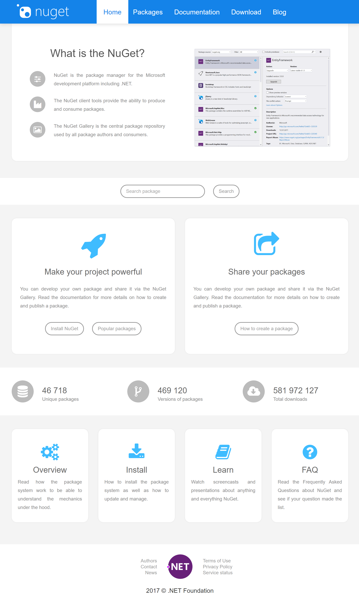

## nuget-modern-website
This project was created to check how the official NuGet website will look like after applying modern webdesign styles. The most important details are listed below:
- the project is based on the .NET Core technology,
- it is only a prototype (much better results can be obtained),
- information present on the website is correct and up-to-date because the script is communicating through the APIv3 with the NuGet platform.

# Searching for package

# Package's details

# Downloads section

# Problems
During the implementation, some problems were encountered:
- some information provided by the NuGet's APIv3 are inconcistent, e.g. links to the package's icons sometimes are not working (maybe JS script can solve this problem and replace not working icon with placeholder? maybe the NuGet should clean the database from such URLs?),
- lists of packages got from the APIv3 have different forms (some additional conditions were added to the package repository class),
- 

# Main page

# Searching for package

# Package's details

# Downloads section

